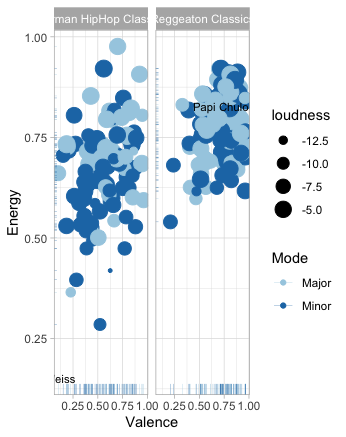

```{r setup, include=FALSE}
library(flexdashboard)
library(tidyverse)
library(spotifyr)
library(compmus)
source('spotify.R')
```

Column {data-width=650}
-----------------------------------------------------------------------

### Introduction 

```{r}
This is my introduction page
```

Column {data-width=350}
-----------------------------------------------------------------------

### Visualisation 1

```{r}

```

### Chart C

```{r}

```

